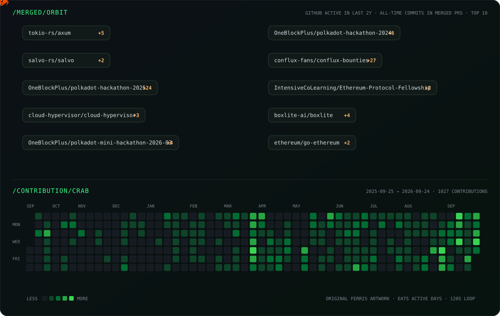

# Hi, I'm aiqubits 👋

I build **AI-native systems**, **agent runtimes**, and **future computing infrastructure** in Rust.

⚡ Building [AINS](https://github.com/aiqubits/AINS), [KeyCompute](https://github.com/keycompute/keycompute), and [rust-agent](https://github.com/aiqubits/rust-agent).

### Open-source contributions

Meanwhile, I am a contributor to the following open-source projects.

