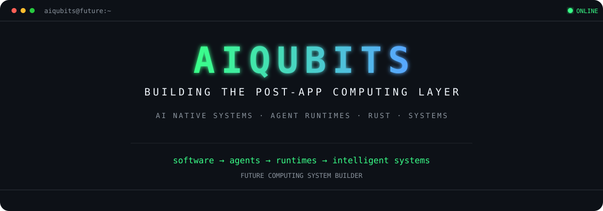
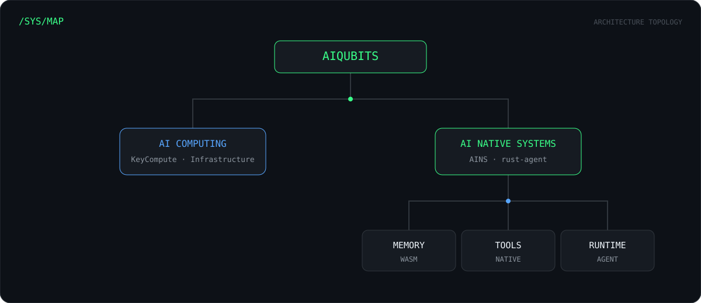
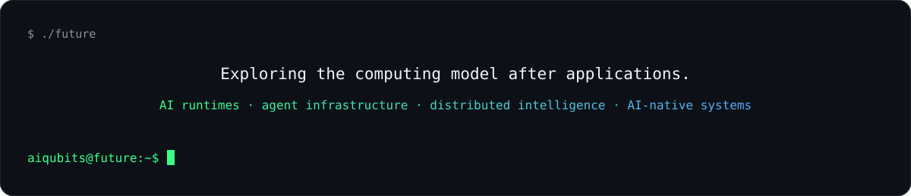

**AI is not a feature. AI is the runtime.**

[AINS](https://github.com/aiqubits/AINS) · [KeyCompute](https://github.com/aiqubits/KeyCompute) · [rust-agent](https://github.com/aiqubits/rust-agent)

---

---

---

[AINS](https://github.com/aiqubits/AINS) — AI Native System  
[KeyCompute](https://github.com/aiqubits/KeyCompute) — AI Computing Infrastructure  
[rust-agent](https://github.com/aiqubits/rust-agent) — Composable Rust Agent Runtime

---

**BUILDING THE POST-APP COMPUTING LAYER**

