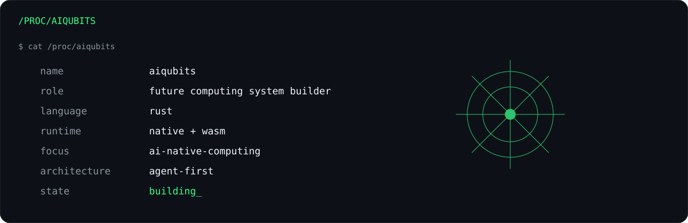

<div align="center">


<br/>

**I build systems where AI is not a feature. AI is the runtime.**

Applications were built around users.  
The next generation of software will be built around intelligence.

[](https://github.com/aiqubits/AINS)
[](https://github.com/aiqubits/KeyCompute)
[](https://www.rust-lang.org/)

</div>

---

## `// SYSTEM MAP`

<a href="https://github.com/aiqubits/AINS"></a>

> **AIQUBITS is not a collection of repositories. It is an exploration of a computing stack built around intelligence.**

| Layer | System | Direction |
|:--|:--|:--|
| `AI COMPUTING` | [**KeyCompute**](https://github.com/aiqubits/KeyCompute) | AI computing infrastructure |
| `AI NATIVE` | [**AINS**](https://github.com/aiqubits/AINS) | AI-native system architecture |
| `AGENT RUNTIME` | **rust-agent** | Compile-time composable agent runtime |
| `EXECUTION` | **Native + WASM** | One runtime model across environments |

---

## `// /PROC/AIQUBITS`



<details>
<summary><b>▶ cat /proc/aiqubits/beliefs</b> — click to inspect the system beliefs</summary>
<br/>

```text
01  AI will become a computing primitive.
02  Agents need runtimes, not wrappers.
03  Memory belongs inside the system.
04  Rust is a strong foundation for AI-native software.
05  The application model will change.
```

</details>

<details>
<summary><b>▶ cat /proc/aiqubits/now</b> — click to inspect what is running now</summary>
<br/>

```text
[ACTIVE]  AINS architecture
[ACTIVE]  rust-agent runtime
[ACTIVE]  compile-time component boundaries
[ACTIVE]  Native / WASM portability
[RUNNING] future-computing-model
```

</details>

---

## `// SYSTEMS I AM BUILDING`

<table>
<tr>
<td width="50%" valign="top">

### `01 / AINS`
**AI Native System**

What if AI were not embedded inside applications?  
What if the application itself were built around intelligence?

`Agent Runtime` · `Memory` · `Tools` · `Native/WASM` · `Rust`

[**ENTER SYSTEM →**](https://github.com/aiqubits/AINS)

</td>
<td width="50%" valign="top">

### `02 / KEYCOMPUTE`
**AI Computing Infrastructure**

Exploring infrastructure where compute and intelligence become programmable system primitives.

`AI Compute` · `Infrastructure` · `Distributed Systems` · `Rust`

[**ENTER SYSTEM →**](https://github.com/aiqubits/KeyCompute)

</td>
</tr>
<tr>
<td width="50%" valign="top">

### `03 / RUST-AGENT`
**Composable Agent Runtime**

A minimal request-response core with capabilities assembled as compile-time components — not runtime plugin machinery.

`Core` · `Components` · `Feature Graph` · `Native/WASM`

[**TRACE IN AINS →**](https://github.com/aiqubits/AINS/tree/main/crates/rust-agent)

</td>
<td width="50%" valign="top">

### `04 / EXPERIMENTS`
**Systems from first principles**

The surrounding work: runtimes, protocols, distributed systems, developer infrastructure and new computing interfaces.

`Runtime` · `Protocols` · `Systems` · `Research`

[**EXPLORE REPOSITORIES →**](https://github.com/aiqubits?tab=repositories)

</td>
</tr>
</table>

---

## `// COMPUTING STACK`

```text
                         intelligence
                              │
                             LLM
                              │
                            Agents
                              │
                           Runtime
                              │
                   ┌──────────┴──────────┐
                 Native                WASM
                   │                     │
                   └──────── Rust ───────┘
                              │
                       System Primitives
                              │
                    Operating Systems
                              │
                           Hardware
```

> I care less about framework collections and more about **runtimes, boundaries, protocols and primitives**.

---

## `// INTERACTIVE CONSOLE`

<details>
<summary><code>aiqubits@future:~$ ./inspect --ains</code></summary>
<br/>

**AINS** asks what software looks like when intelligence becomes part of the system architecture rather than another API feature.  
→ [Open AINS](https://github.com/aiqubits/AINS)

</details>

<details>
<summary><code>aiqubits@future:~$ ./inspect --rust-agent</code></summary>
<br/>

**rust-agent** is being shaped around a minimal core and compile-time composable capabilities: everything optional, dependencies explicit, Native and WASM first-class.  
→ [Open rust-agent](https://github.com/aiqubits/AINS/tree/main/crates/rust-agent)

</details>

<details>
<summary><code>aiqubits@future:~$ ./inspect --keycompute</code></summary>
<br/>

**KeyCompute** explores the infrastructure side of the same future: programmable AI computing as a system primitive.  
→ [Open KeyCompute](https://github.com/aiqubits/KeyCompute)

</details>

---

## `// PHILOSOPHY`

<div align="center">

### `Software should disappear into capability.`

**Build primitives. Define boundaries. Compose systems.**  
**Make intelligence native.**

</div>

---


<div align="center">

[**AINS**](https://github.com/aiqubits/AINS) · [**KeyCompute**](https://github.com/aiqubits/KeyCompute) · [**Repositories**](https://github.com/aiqubits?tab=repositories)

<sub>AIQUBITS // FUTURE COMPUTING SYSTEM BUILDER</sub>

</div>
